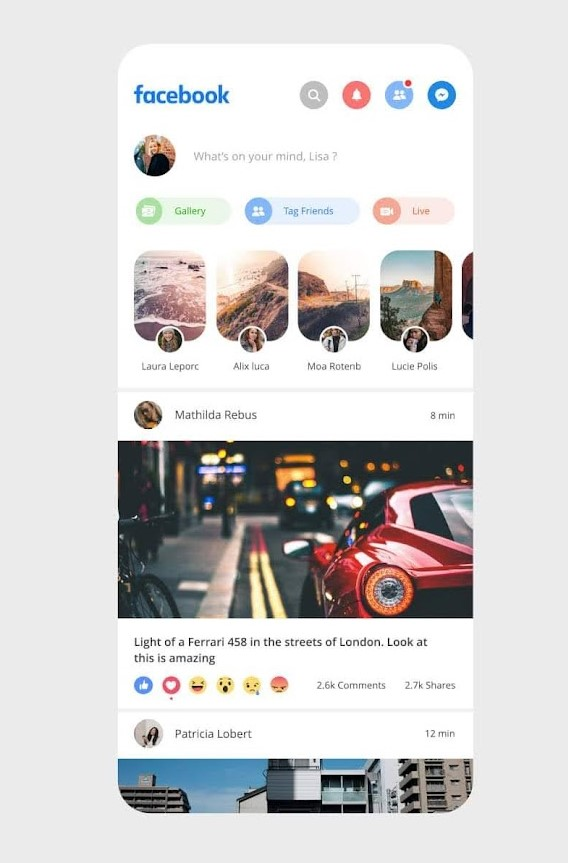
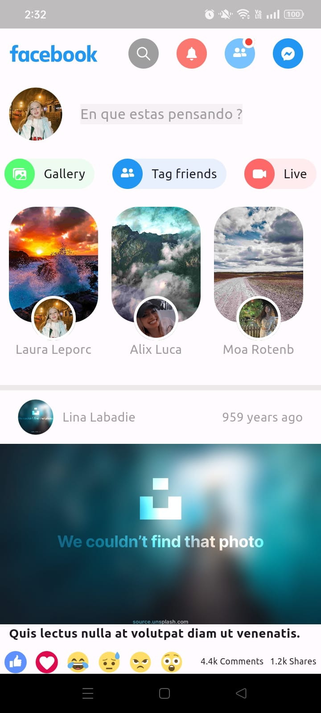
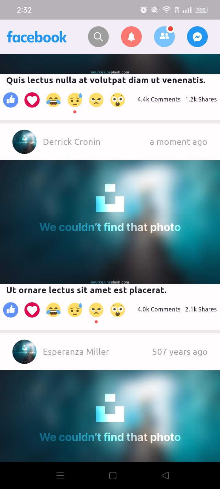

# facebook UI en Flutter

En este proyecto se intento replicar la interfaz de Facebook apegandose lo mas posible al siguiente diseño y se implementaron algunos Widgets para que la interfaz se adaptara a diferentes dispositivos.

## Diseño original
 ![]

## Imagenes del proyecto

 ![]
 ![]